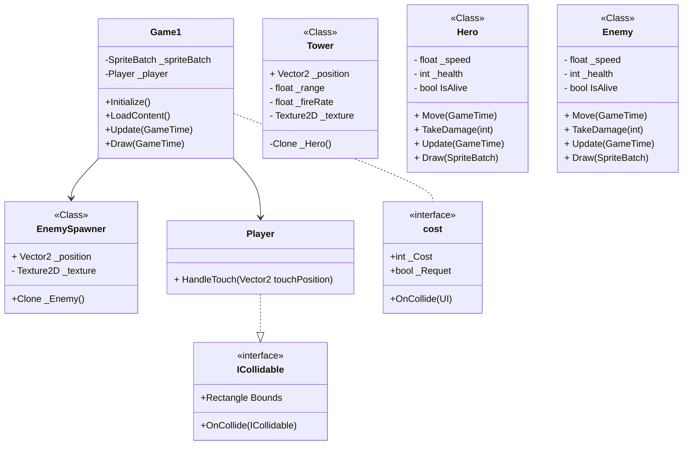

# Class Diagram — [Underwake]

```mermaid
classDiagram
    class Game1 {
        -SpriteBatch _spriteBatch
        -Player _player
        +Initialize()
        +LoadContent()
        +Update(GameTime)
        +Draw(GameTime)
    }
    class Tower{
        <<Class>>
-Clone _Hero()
  + Vector2 _position   
  - float _range   
  - float _fireRate   
  - Texture2D _texture  

      }
class Hero{
        <<Class>>

- float _speed  
- int _health   
- bool IsAlive  
  
 + Move(GameTime)   
 + TakeDamage(int)   
 + Update(GameTime)  
+ Draw(SpriteBatch)  
}
  
class Enemy{
        <<Class>>

   - float _speed  
   - int _health   
   - bool IsAlive  
  
    + Move(GameTime)   
    + TakeDamage(int)   
    + Update(GameTime)  
    + Draw(SpriteBatch)  
}
   

     class EnemySpawner{
        <<Class>>
	+ Vector2 _position   
        +Clone _Enemy()
        - Texture2D _texture 
}
	class Player{
	+ HandleTouch(Vector2 touchPosition)
}

     class cost{
<<interface>>
       +int _Cost
      +bool _Requet
      +OnCollide(UI)
   
}


    class ICollidable {
        <<interface>>
        +Rectangle Bounds
        +OnCollide(ICollidable)
    }
    Game1 --> Player
    Game1 --> EnemySpawner
    Player ..|> ICollidable
    Game1 .. cost
```
