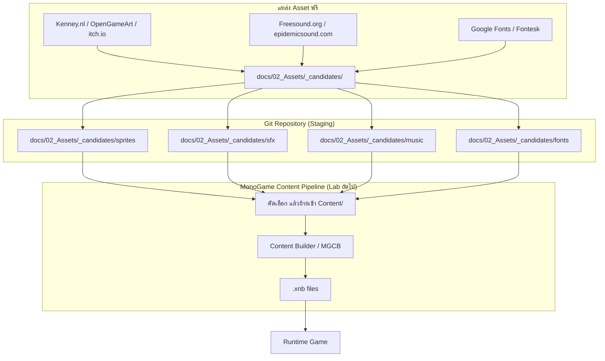

## Asset Pipeline Flow

```mermaid
flowchart TD
    subgraph SOURCES["แหล่ง Asset ฟรี"]
        K1[Kenney.nl / OpenGameArt / itch.io] --> C1[docs/02_Assets/_candidates/]
        K2[Freesound.org / epidemicsound.com] --> C1
        K3[Google Fonts / Fontesk] --> C1
    end

    subgraph REPO["Git Repository (Staging)"]
        C1 --> R1[docs/02_Assets/_candidates/sprites]
        C1 --> R2[docs/02_Assets/_candidates/sfx]
        C1 --> R3[docs/02_Assets/_candidates/music]
        C1 --> R4[docs/02_Assets/_candidates/fonts]
    end

    subgraph PIPELINE["MonoGame Content Pipeline (Lab ถัดไป)"]
        R1 --> CP[คัดเลือก แล้วย้ายเข้า Content/]
        R2 --> CP
        R3 --> CP
        R4 --> CP
        CP --> P1[Content Builder / MGCB]
        P1 --> XNB[.xnb files]
    end

    XNB --> GAME[Runtime Game]
```
