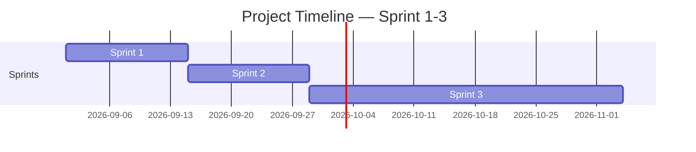

<!-- Template เต็มไฟล์สำหรับสร้าง docs/agile/02-sprint-backlog.md -->

<!-- ภาพรวมว่า Story ไหนไปอยู่ Sprint ไหนตลอด 4 Sprint — ไม่ต้องระบุคนรับผิดชอบ/Status ที่นี่ ส่วนนั้นอยู่ใน sprint-plan-[NN].md ของ Sprint ที่กำลังทำ -->

# Sprint Backlog

**Version:** 1.0 | **Last Updated:** 2026-09-01

> ภาพรวมว่า User Story ไหนจาก `01-product-backlog.md` จะไปอยู่ Sprint ไหน — Sprint ที่ยังไม่ถึงคือ draft คร่าวๆ ปรับได้เสมอเมื่อเข้าใจงานมากขึ้น

## Timeline (4 Sprint, Sprint ละ 2 สัปดาห์)

| Sprint   | เริ่ม | สิ้นสุด |
| -------- | ---------- | -------------- |
| Sprint 1 | 2026-09-01 | 2026-09-14     |
| Sprint 2 | 2026-09-15 | 2026-09-28     |
| Sprint 3 | 2026-09-29 | 2026-11-4      |

> ปรับวันที่ให้ตรงกับวันที่ทีมเริ่มลงมือทำจริง (ถ้าไม่ใช่วันแลปนี้)

## Sprint 1 (กำลังทำ)

| # | User Story                                                                        | MoSCoW      | Estimate (SP) |
| - | --------------------------------------------------------------------------------- | ----------- | ------------- |
| 1 | As a player, I want to Fight, so that I Need Enemy to fight                       | Must Have   | 5             |
| 2 | As a player, I want to Fight, so that I Need System to make me to fight           | Must Have   | 3             |
| 3 | As a player, I want More Character , so that To make me strong                    | Must Have   | 8             |
| 4 | As a player, I want to see my Hp bars, so that I know how close I am to game over | Should Have | 3             |

## Sprint 2 (Draft)

| # | User Story                                                                             | MoSCoW      | Estimate (SP) |
| - | -------------------------------------------------------------------------------------- | ----------- | ------------- |
| 1 | As a player, I want to see UI, so that I can interact in game                          | Should Have | 7             |
| 2 | As a player, I want to Fight, so that I Need Animation sprite sheet to see my Movement | Must Have   | 1             |
| 3 | As a player, I want to Stand , so that I Need Background stage to make me stand        | Must Have   | 6             |
| 4 | As a player, I want to see my Ultimate skill, so that To make me feel impact           | Should Have | 15            |

## Sprint 3 (Draft)

| # | User Story                                                                             | MoSCoW       | Estimate (SP) |
| - | -------------------------------------------------------------------------------------- | ------------ | ------------- |
| 1 | As a player, I want to add more skill, so that I can attack in various ways.         | Nice to Have | 7             |
| 2 | As a designer, I want to store data, so that I can to continue previous play          | Nice to Have | 3             |
| 3 | As a player, I want to hear SFX, so that To make me feel impressive                    | Should Have  | 3             |
| 4 | As a player, I want to see Fx particle, so that to make me feel immersive atmosphere | Nice to Have | 9             |

> **Sprint 2-3 คือ draft ระดับ release plan** — เป้าหมายคือฝึกกะจำนวน SP ต่อ Sprint ให้ใกล้เคียง capacity ของทีม ไม่ใช่ล็อก scope ตายตัว ปรับได้ทุกครั้งที่ทำ Sprint Planning ของ Sprint ถัดไป

> เมื่อ Sprint ไหนเริ่มทำงานจริง ให้คัดลอก template `sprint-plan-template.md` (ไฟล์แนบใน LMS) ไปสร้าง `docs/agile/sprint-plan-[NN].md` แล้วดึง Story ของ Sprint นั้นจากตารางด้านบนมาใส่คนรับผิดชอบ แตก Task และปรับ Estimate ให้ละเอียดขึ้น

## Links

- [[docs/agile/01-product-backlog|Product Backlog]]
- [[docs/agile/sprint-plan-01|Sprint 1 Plan]]
