# 48-Hour Timeline — [J.V.O.C]

| หัวข้อ                             | รายละเอียด                    |
| ---------------------------------------- | --------------------------------------- |
| Time Keeper                              | [นายวุฒิภัทร นวมนิ่ม] |
| Jam เริ่มจริง (วัน-เวลา) | [ศ. 24 ก.ค. 2569 12:00]              |
| Deadline ส่งงาน (วัน-เวลา)  | [อา. 26 ก.ค. 2569 19:00]            |

> คำนวณ "เวลาจริง" ของแต่ละ Phase จาก **เวลาที่ Jam เริ่มจริง** ด้านบน แล้วเติมในคอลัมน์ขวาสุด — ใช้ตารางนี้เป็นจุดอ้างอิงเดียวของทีมตลอด 48 ชม.

| Phase                                       | ช่วง (Hour) | เวลาจริง (Hour 0 = เวลาเริ่ม Jam) | เป้าหมาย / Deliverable                                                                   | สถานะ | เวลาจริงที่เสร็จ |
| ------------------------------------------- | --------------- | -------------------------------------------------- | ------------------------------------------------------------------------------------------------ | ---------- | -------------------------------- |
| 0. Kickoff & Ideation                       | 0–3            | [เวลา] – [เวลา]                           | รู้ theme, brainstorm, ล็อกคอนเซปต์ + core loop 1 บรรทัด                    | 🔲         |                                  |
| 1. Planning & Setup                         | 3–6            | [เวลา] – [เวลา]                           | GDD one-pager, ตกลง pipeline, ตั้ง repo, แบ่งงาน                                  | 🔲         |                                  |
| 2. Core Pipeline & Skeleton                 | 6–11           | [เวลา] – [เวลา]                           | Game loop โครงหลักรันได้ (state, input, render ว่างเปล่า)                 | 🔲         |                                  |
| 3. Core Mechanic                            | 11–24          | [เวลา] – [เวลา]                           | กลไกหลักเล่นได้จริง 1 อย่าง —**Playable Build Checkpoint**        | 🔲         |                                  |
| 5. 🔒 Feature Freeze                        | ที่ Hour 34  | [เวลา]                                         | **ห้ามเพิ่ม feature ใหม่หลังจุดนี้** ทุกคน merge เข้า main | 🔲         |                                  |
| 6. Polish & Bugfix                          | 24–30          | [เวลา] – [เวลา]                           | แก้บั๊ก, ปรับ balance, juice/feedback เล็กๆ                                      | 🔲         |                                  |
| 7. Testing (คนนอกทีมลองเล่น) | 30–34          | [เวลา] – [เวลา]                           | playtest, จด bug ที่เหลือ, แก้เฉพาะตัวที่ critical                       | 🔲         |                                  |
| 8. Build & Package                          | 34–37          | [เวลา] – [เวลา]                           | สร้าง build จริง, ทดสอบบนเครื่องอื่น, เตรียมหน้า submission | 🔲         |                                  |
| 9. Buffer & Submit                          | 37–39          | [เวลา] – [เวลา]                           | เผื่อเวลาหน้างาน, ส่งงานก่อนเวลาอย่างน้อย 15 นาที     | 🔲         |                                  |

```mermaid
gantt
    title Game Jam 48 ชั่วโมง — [J.V.O.C]
    dateFormat s
    axisFormat %c 
    section Plan
    Kickoff & Ideation        :a7,2026-07-24 12:00, 3h
    Planning & Setup          :a8,after a7, 3h
    section Build
	Core Pipeline & Skeleton	:a2,after a8, 5h
	Core Mechanic (Playable @24h)	:a3,after a2, 13h
    section Ship
Polish & Bugfix :a4,after a3, 6h
Testing :a5,after a4, 4h
Build & Package :a6,after a5, 3h
Buffer & Submit :a9,after a6, 2h
```

## กติกา Checkpoint

- ถ้าถึงเวลาใน Phase ใดแล้วยังไม่เสร็จ → **Time Keeper** เรียกประชุมด่วน (ไม่เกิน 5 นาที) เพื่อตัด scope ทันที ตาม cut-list ใน [01-pipeline-checklist.md](01-pipeline-checklist.md)
- ห้ามปล่อยให้ Phase ที่ล่าช้าลากยาวไปกระทบ Phase ถัดไปเกิน [1 ชม.]
- อัปเดตคอลัมน์ "สถานะ" และ "เวลาจริงที่เสร็จ" ทุกครั้งที่ปิด Phase เพื่อให้ทั้งทีมเห็นความคืบหน้าตรงกัน
