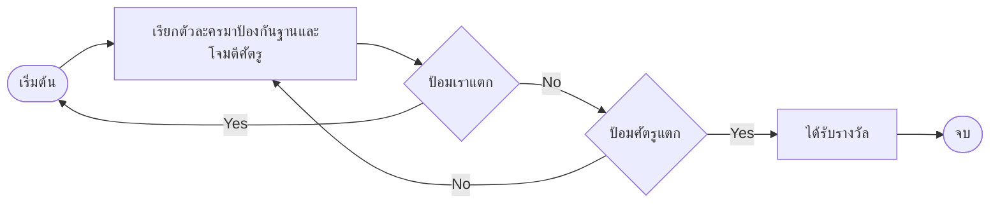

# [The Tower Line Battle] — Core Loop & Gameplay

## Core Loop

## Core Mechanics

1. [Mechanic หลักที่ 1 — การเรียกตัวละครมาป้องกันฐาน]
2. [Mechanic หลักที่ 2 - ระบบค่าcostในการเรียกใช้]
3. [Mechanic หลักที่ 3 - บริหารทรัพยากร]

## Controls

| Key | Action |
| Mouse1 | Accept-all UI |
| Space | ChangeTeamslot |
| press 1 | Sp skill 1 |
| press 2 | Sp skill 2 |
| press 3 | Sp skill 3 |
| press 4 | Sp skill 4 |

## Win / Lose Condition

- **ชนะเมื่อ:** [ป้อมศัตรูแตก]
- **แพ้เมื่อ:** [ป้อมผู้เล่นแตก]
