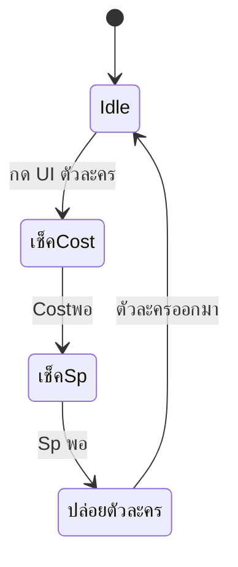

# Mechanic Design — [ปล่อยตัวละคร]

## State Diagram

## Rules

| State | เข้าเงื่อนไข     | ออกเงื่อนไข               | Note             |
| ----- | ---------------------------- | ------------------------------------ | ---------------- |
| Idle  | เริ่มเกม             | กดปล่อยตัวละคร         | Animation loop   |
| Cost  | กดปล่อยตัวละคร | ค่า Cost พอกับตัวละคร | Cost = [ค่า] |
| Sp    | กดปล่อยตัวละคร | ค่า Sp พอกับตัวละคร  | Sp = [ค่า]   |
